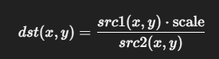

# Function 1:
```python
elif tool == 'enhance':
    img_yuv = cv2.cvtColor(img, cv2.COLOR_BGR2YUV)
    img_yuv[:,:,0] = cv2.equalizeHist(img_yuv[:,:,0])
    processed_img = cv2.cvtColor(img_yuv, cv2.COLOR_YUV2BGR)

```
Now,
```python
img_yuv = cv2.cvtColor(img, cv2.COLOR_BGR2YUV)
```
Converts the image from BGR (OpenCV default) to YUV color space.

Y → Luminance (brightness)

U → Chrominance (blue color difference)

V → Chrominance (red color difference)


```python
img_yuv[:,:,0] = cv2.equalizeHist(img_yuv[:,:,0])
```
`img_yuv[:,:,0]` selects the Y (luminance) channel.

`cv2.equalizeHist()` redistributes intensity values for better contrast.

💡 Effect: Dark areas become brighter, bright areas more detailed — overall improved contrast.

```python
processed_img = cv2.cvtColor(img_yuv, cv2.COLOR_YUV2BGR)
```
Converts enhanced YUV image back to BGR for display or saving.

# Function 2:

```python
elif tool == 'blur':
    processed_img = cv2.GaussianBlur(img, (21, 21), 0)
```

`cv2.GaussianBlur(src, ksize, sigmaX)`
src ->	Input image (your original img)

ksize -> Kernel size (width, height) — must be odd numbers, e.g., (21, 21)

sigmaX	-> Standard deviation in X direction (0 means OpenCV calculates it automatically)

🔸 Step 2: (21, 21) → Kernel Size

This defines the size of the Gaussian filter.

Larger kernels = stronger blur.

Example effects:

(3, 3) → slight blur

(21, 21) → very smooth, heavy blur

# Function 3:

```python
elif tool == 'sketch':
        gray_img = cv2.cvtColor(img, cv2.COLOR_BGR2GRAY)
        invert = cv2.bitwise_not(gray_img)
        blur = cv2.GaussianBlur(invert, (21, 21), 0)
        inverted_blur = cv2.bitwise_not(blur)
        processed_img = cv2.divide(gray_img, inverted_blur, scale=256.0)
```

```python
gray_img = cv2.cvtColor(img, cv2.COLOR_BGR2GRAY)
```
Converts the original image to grayscale (removes color).

Sketches are usually black & white, so we only need intensity (brightness).

```python
invert = cv2.bitwise_not(gray_img)
``` 
`cv2.bitwise_not()` inverts pixel values:

Black → White

White → Black

Creates a negative image.

```python
blur = cv2.GaussianBlur(invert, (21, 21), 0)
``` 
Blurs the inverted image using a Gaussian filter.

Large kernel (21,21) makes the blur smooth.

The blurred inverted image will later help highlight edges.

```python
inverted_blur = cv2.bitwise_not(blur)
``` 
Inverts the blurred image back to positive.

Now the bright regions of the original become darker, and the edges are emphasized.

```python
processed_img = cv2.divide(gray_img, inverted_blur, scale=256.0)
```

`cv2.divide()` divides gray_img by inverted_blur pixel-wise:

`dst = cv2.divide(src1, src2, scale=scale)`



This enhances edges and creates a sketched look.

`scale=256.0` ensures the pixel values remain in the range [0,255].

# Function 4:

```python
elif tool == 'face_detect':
        # Make sure 'haarcascade_frontalface_default.xml' is in the same directory
        face_cascade = cv2.CascadeClassifier('haarcascade_frontalface_default.xml')
        gray = cv2.cvtColor(img, cv2.COLOR_BGR2GRAY)
        faces = face_cascade.detectMultiScale(gray, 1.1, 4)
        for (x, y, w, h) in faces:
            cv2.rectangle(img, (x, y), (x+w, y+h), (255, 0, 0), 3)
        processed_img = img
```

This code performs **face detection** on an image using OpenCV’s Haar Cascade classifier. First, it loads the pre-trained model `haarcascade_frontalface_default.xml` and converts the input image to **grayscale** because Haar cascades work on intensity values. Then `detectMultiScale()` scans the image at multiple scales to find faces, returning rectangles `(x, y, w, h)` for each detected face. The loop draws a **blue rectangle** with thickness 3 around every detected face on the original image. Finally, the processed image with the highlighted faces is returned in `processed_img`.

# Function 5: 

```python
elif tool == 'posterize':
        K = 8 # Number of colors to reduce to
        Z = img.reshape((-1,3))
        Z = np.float32(Z)
        criteria = (cv2.TERM_CRITERIA_EPS + cv2.TERM_CRITERIA_MAX_ITER, 10, 1.0)
        _, label, center = cv2.kmeans(Z, K, None, criteria, 10, cv2.KMEANS_RANDOM_CENTERS)
        center = np.uint8(center)
        res = center[label.flatten()]
        processed_img = res.reshape((img.shape))
```

This code performs **posterization** on an image, reducing it to a limited number of colors to create a stylized effect. First, it sets `K = 8`, the number of colors to reduce the image to, and reshapes the image into a 2D array `Z` of pixels with 3 color channels, converting it to `float32` for processing. Then it applies **K-Means clustering** with a termination criterion of either 10 iterations or a minimal change of 1.0, grouping pixels into `K` clusters. The `center` array contains the cluster colors, which are converted back to `uint8`, and each pixel is replaced by its cluster center using `label`. Finally, the result is reshaped to the original image shape, producing a **posterized image with only 8 dominant colors**.

# Function 6:

```python
elif tool == 'resize':
        try:
            width = int(request.form.get('width'))
            height = int(request.form.get('height'))
            if width > 0 and height > 0:
                processed_img = cv2.resize(img, (width, height), interpolation=cv2.INTER_AREA)
        except (ValueError, TypeError):
            return jsonify({'error': 'Invalid width or height provided.'}), 400
```

This code resizes an image based on user input from a web form. It first retrieves the desired `width` and `height` from the form data and converts them to integers. If both values are positive, it uses `cv2.resize()` with `INTER_AREA` interpolation (ideal for shrinking images) to resize the original image to the specified dimensions and stores it in `processed_img`. If the user provides invalid values (non-numeric or negative), the `try-except` block catches the error and returns a JSON response with an error message and HTTP status 400.

# Function 7:

```python
elif tool == 'compress':
        try:
            quality = int(request.form.get('quality', 90))
            encode_param = [int(cv2.IMWRITE_JPEG_QUALITY), quality]
            _, buffer = cv2.imencode('.jpg', img, encode_param)
            return send_file(io.BytesIO(buffer), mimetype='image/jpeg')
        except (ValueError, TypeError):
            return jsonify({'error': 'Invalid quality value.'}), 400
```

This code compresses an image and sends it back as a JPEG file. It first retrieves the `quality` parameter from the web form, defaulting to 90 if not provided, and ensures it’s an integer. It then sets the JPEG encoding parameter `cv2.IMWRITE_JPEG_QUALITY` to this value and uses `cv2.imencode()` to encode the image into JPEG format in memory. The resulting byte buffer is wrapped in `io.BytesIO` and sent to the client with `send_file()` and MIME type `image/jpeg`. If the user provides an invalid quality value (non-numeric or inappropriate), the `try-except` block catches it and returns a JSON error with HTTP status 400.

# Function 8:
```python 
elif tool == 'qr_scan':
        detector = cv2.QRCodeDetector()
        data, _, _ = detector.detectAndDecode(img)
        if data:
            return jsonify({'text': data})
        else:
            return jsonify({'text': 'No QR code found or could not be decoded.'})
```
This code detects and decodes a **QR code** from an image using OpenCV. It creates a `QRCodeDetector` object and calls `detectAndDecode(img)`, which returns the decoded text if a QR code is found. If decoding is successful, it returns the text in a JSON response; otherwise, it returns a JSON message stating that no QR code was found or it could not be decoded. This allows a web application to read QR codes directly from uploaded images.

# EXTRA(For output or Error):

```python
if processed_img is not None:
        _, img_encoded = cv2.imencode('.png', processed_img)
        return send_file(io.BytesIO(img_encoded.tobytes()), mimetype='image/png')

    return jsonify({'error': 'Invalid tool or processing failed.'}), 400
```

This code handles sending the processed image back to the client in a web application. If `processed_img` exists (i.e., the image was successfully processed by a tool), it encodes the image into **PNG format** using `cv2.imencode()`, converts it to bytes, wraps it in `io.BytesIO`, and returns it with `send_file()` specifying the MIME type `'image/png'`. If `processed_img` is `None` (meaning processing failed or an invalid tool was requested), it returns a JSON response with an error message and HTTP status 400.
